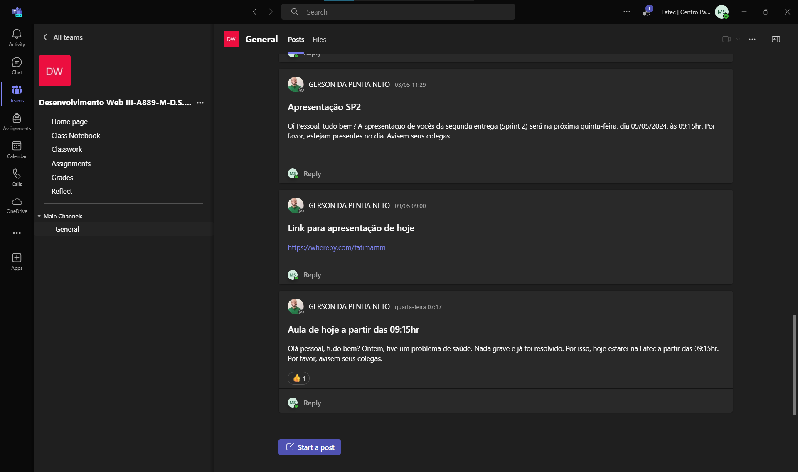
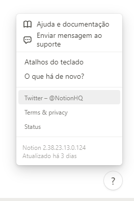
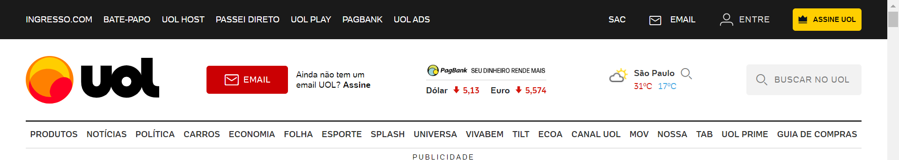
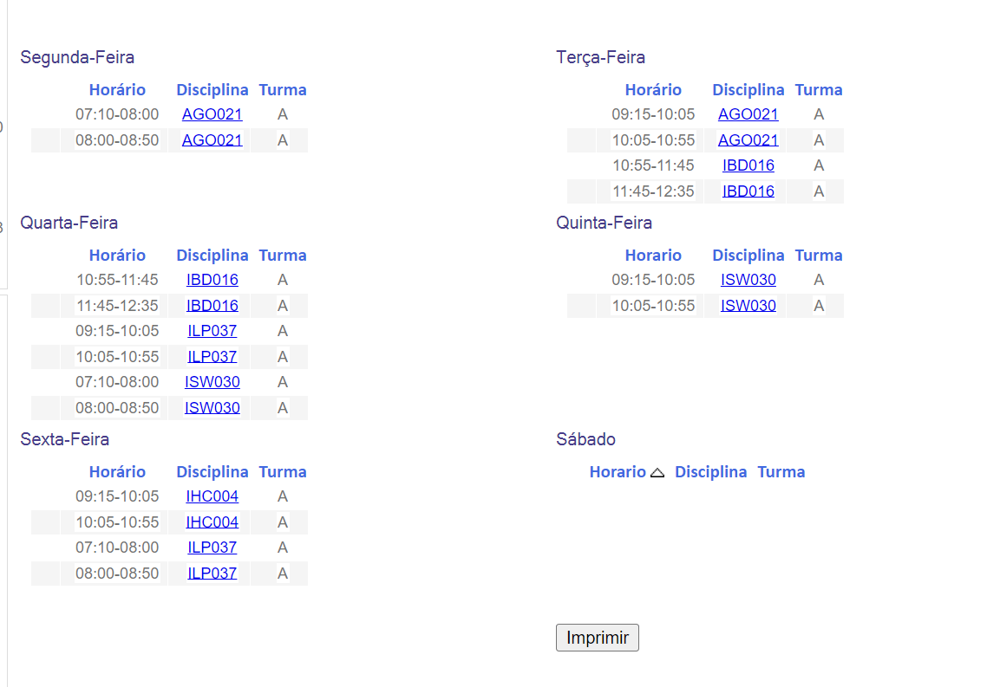
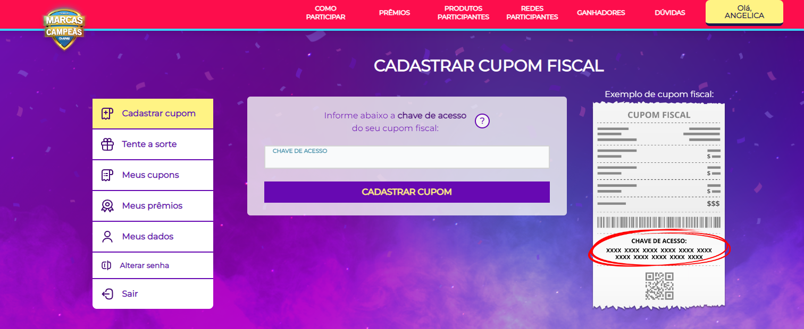
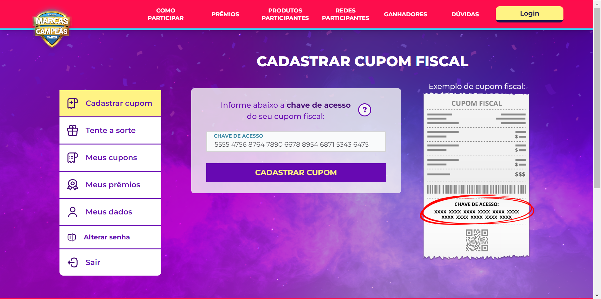
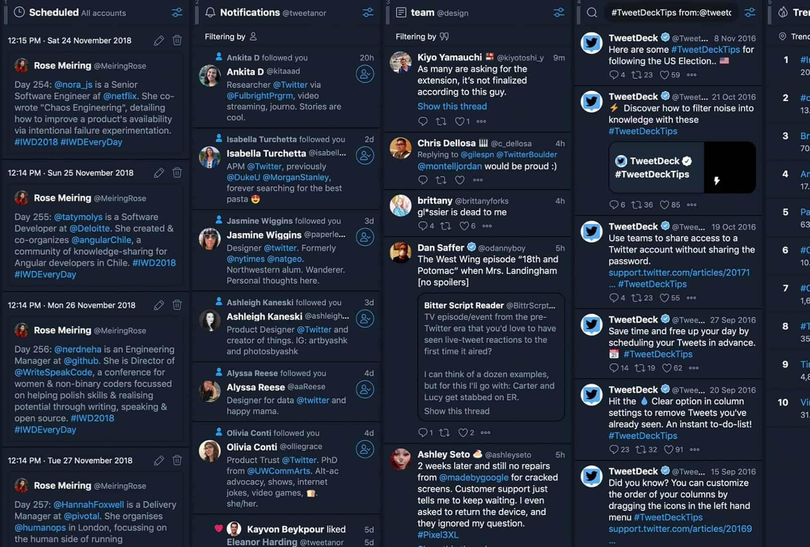
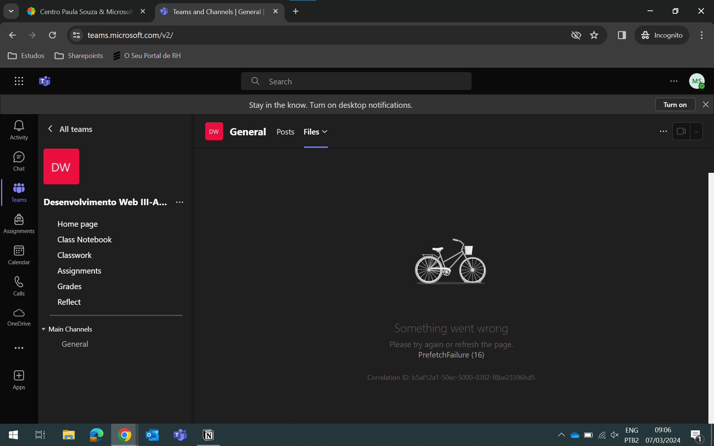

# Aplicação das 10 heurísticas de usabilidade

> Link com documentação base: [Ten Usability Heuristics](https://www.nngroup.com/articles/ten-usability-heuristics/)

# ✔ Acerto
## **Heurística 6**: Reconhecimento em vez de lembrança
É possível navegar em todo o site com liberdade, e sem precisar se preocupar em lembrar como voltar para determinadas telas.

## **Heurística 10**: Ajuda e documentação
Com o fácil acesso a documentação e suporte ao uso da ferramenta

  

# ❌ Erros
## **Heurísitca 2**: Correspondência entre o sistema e o mundo real
São usados jargões que apenas pessoas familiarizadas com as funções do Uol teriam facilidade de entender. Como por exemplo: "SPLASH", "TILT", "MOV"

 

## **Heurística 4**: Consistência e Padrões
Com a falta de padrões, o usuário possui dificuldades de entender as funções do site. Na imagem a seguir temos dois usos de botões sendo que um deles são apenas palavras que não se assemelham com o botão "imprimir"

## **Heurística 5**: Prevenção de erro
Sem a presença de um texto guia dentro do input não é possível identificar a maneira correta de cadastrar.

Demonstração sem preenchimento:

Demonstração que seguindo o padrão exemplo na imagem não é possível incluir todos os números do cupom:

## **Heurística 8**: Design Estético e Minimalista
Mesmo que está seja a proposta do aplicativo, deveria ter uma maneira de evitar todo esse acúmulo de informação na tela do usuário

## **Heurística 9**: Ajude os usuários a reconhecer, diagnosticar e se recuperar de erros
Em momentos de erros na aplicação, é importante que o usuário saiba como resolver, esta explicação deve ser feita de modo simples e de fácil entendimento de todos.

Na imagem não é possivel entender o que deu de errado e nem sequer como sair desta situação. O único modo de escape seria fechar a tela e recomeçar do zero.
